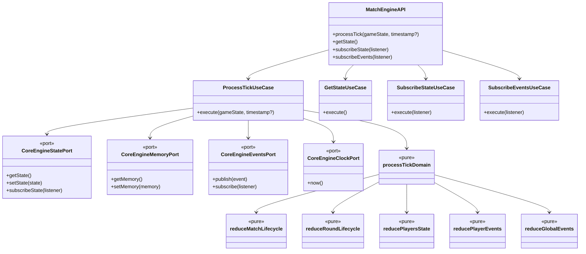
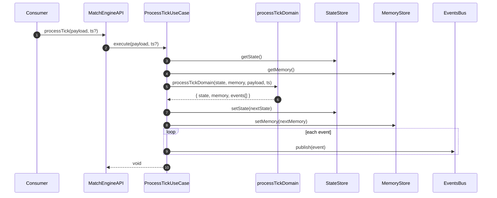
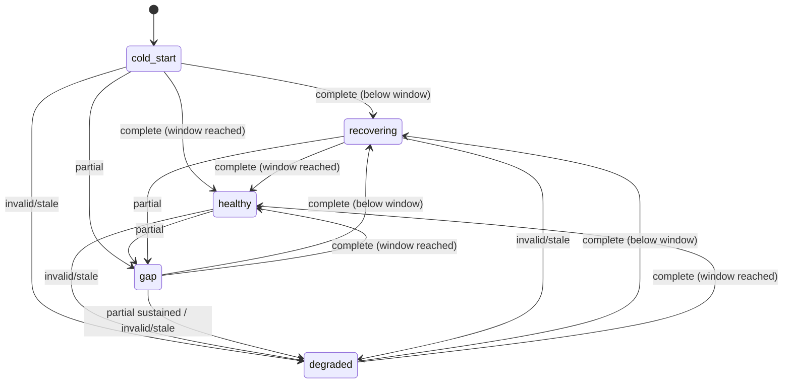
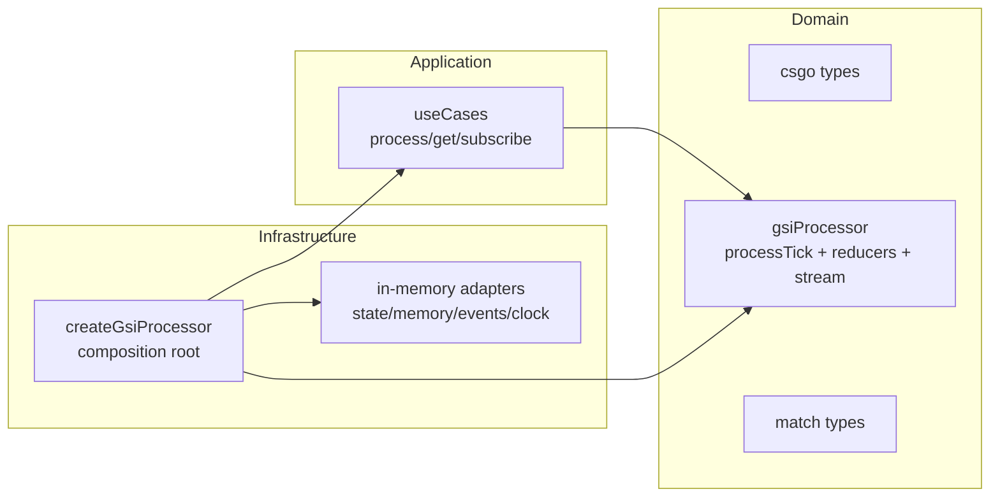
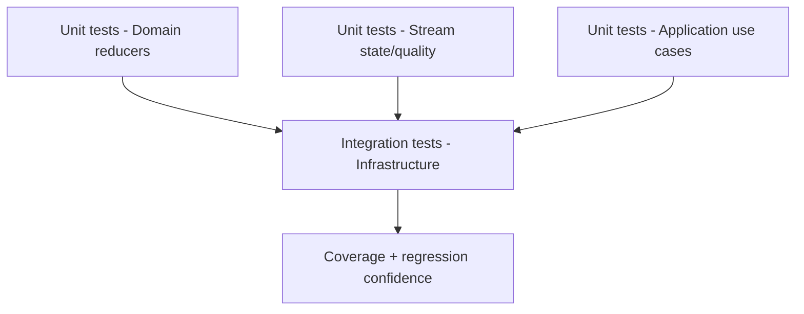
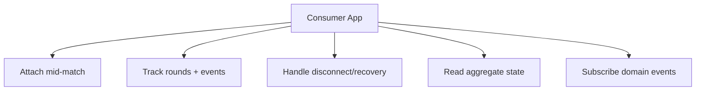

# Architecture (4+1) — `@cs2helper/gsi-processor`

Este documento describe la arquitectura del package usando el modelo **4+1 de Kruchten**:

- Vista lógica
- Vista de procesos
- Vista de desarrollo
- Vista física (deployment)
- Vista de casos de uso (+1)

---

## 1) Vista Lógica

### Objetivo

Explicar los elementos de dominio y cómo colaboran para convertir ticks GSI en:

- estado agregado de partida
- memoria incremental
- eventos de dominio

### Principios

- Arquitectura hexagonal (puertos/adaptadores)
- Dominio puro (sin IO)
- Use cases en application
- Composición en infrastructure
- Engine por instancia (sin singletons globales)

### Diagrama de clases (lógico)



### Diagrama de secuencia (tick end-to-end)



---

## 2) Vista de Procesos

### Objetivo

Describir el comportamiento dinámico del processor al recibir ticks (incluyendo gaps, attach mid-match y recuperación).

### Flujo de actividad principal

```mermaid
flowchart TD
  A[Receive tick] --> B{payload null?}
  B -- Yes --> C[If healthy: mark gap + requiresResync]
  C --> Z[Return]
  B -- No --> D[normalizeWatcherPayload]
  D --> E[evaluateSnapshotQuality]
  E --> F[transitionStreamState]
  F --> G{criticalReducersEnabled?}
  G -- No --> H[Run safe reducers only\n(match/players/global as applicable)]
  G -- Yes --> I[Run full reducer pipeline\n(match/round/players/player-events/global)]
  H --> J[Update memory + watermarks]
  I --> J
  J --> K[Emit operational + domain events]
  K --> Z
```

### Estados operacionales del stream



---

## 3) Vista de Desarrollo

### Objetivo

Mostrar cómo está organizado el código, responsabilidades por carpeta y guías para extenderlo.

### Mapa de módulos (hexagonal)



### Dónde está cada cosa

- **Dominio**
  - `src/domain/gsiProcessor/processTick.ts`: orquestación pura por tick
  - `src/domain/gsiProcessor/reducers/*`: reglas de negocio y proyecciones
  - `src/domain/gsiProcessor/stream/*`: calidad + state machine resiliente
  - `src/domain/csgo/*`: tipado GSI raw/normalizado
  - `src/domain/match/matchTypes.ts`: modelo agregado de partida/ronda/eventos

- **Application**
  - `src/application/gsiProcessor/useCases/*`: puertos + coordinación de casos de uso

- **Infrastructure**
  - `src/infrastructure/gsiProcessor/createGsiProcessor.ts`: composition root público
  - `src/infrastructure/gsiProcessor/internal/*`: adapters en memoria

### Puntos de desarrollo recomendados

- **Nuevo evento de juego**
  1. Añadir tipo en `gsiProcessorTypes.ts`
  2. Implementar inferencia en reducer adecuado (`reducePlayerEvents` o `reduceGlobalEvents`)
  3. Cubrir con unit tests de reducer + integración

- **Nuevo watcher mode / campo GSI**
  1. Extender `domain/csgo/rawWatcherPayload.types.ts`
  2. Mapear en `normalizeWatcherPayload.ts`
  3. Validar en tests de normalización + integración por watcher mode

- **Nueva política de resiliencia**
  1. Ajustar `snapshotQuality.ts` y/o `streamStateMachine.ts`
  2. Revisar gating de reducers críticos
  3. Cubrir transiciones de estado y watermarks

### Tips de desarrollo

- Mantener reducers puros y pequeños (sin IO, sin dependencias de infraestructura)
- Evitar inferencias retroactivas en primer tick de attach
- Priorizar composición sobre herencia (no clases obligatorias)
- Documentar contratos públicos con TSDoc

### Estrategia de pruebas



- **Unit (domain):** reglas de negocio aisladas
- **Unit (application):** delegación correcta a puertos
- **Integration (infrastructure):** wiring real + flujos completos por watcher mode

---

## 4) Vista Física (Deployment)

### Objetivo

Mostrar cómo se ejecuta el package en Node.js y cómo se integra en procesos consumidores.

### Topología de despliegue típica

```mermaid
flowchart LR
  subgraph NodeProcess["Node.js Process (consumer app)"]
    P[Polling / Webhook loop]
    G[createGsiProcessor instance]
    S[In-memory state]
    E[In-memory events bus]
  end

  CS2[CS2 GSI JSON source] --> P
  P -->|processTick(payload)| G
  G --> S
  G --> E
  C1[App handlers / services] -->|getState / subscribe*| G
```

### Consumo recomendado

- Crear **una instancia** por contexto lógico de partida/servidor
- Alimentar ticks con `processTick(payload, timestamp?)`
- Consumir estado con `getState()` o `subscribeState()`
- Consumir eventos con `subscribeEvents()`

### Modelo de proceso

- El package no abre puertos ni hilos por sí mismo
- No depende de Electron ni IPC
- Vive como librería in-process en un runtime Node

---

## 5) +1 Vista de Casos de Uso

### Casos de uso clave

1. **Attach en mitad de partida**
   - Primer tick `live` consistente abre `currentMatch`
   - No emite kills/deaths retroactivos en ese primer tick
   - Deltas siguientes sí generan eventos inferidos

2. **Seguimiento normal de ronda**
   - `freezetime -> live -> over` actualiza rondas y ganador
   - Proyecta estado de jugadores y eventos de combate/economía

3. **Resiliencia ante gaps**
   - `null`/partial/invalid puede mover stream a `gap`/`degraded`
   - Se activa `requiresResync`
   - Al recuperarse, vuelve a `healthy` y reactiva reducers críticos

### Diagrama de casos de uso



---

## Resumen

`@cs2helper/gsi-processor` implementa una arquitectura hexagonal orientada a procesamiento de ticks GSI con:

- dominio puro y testeable
- composición explícita en infraestructura
- resiliencia operacional en stream state machine
- soporte de attach en partida en curso
